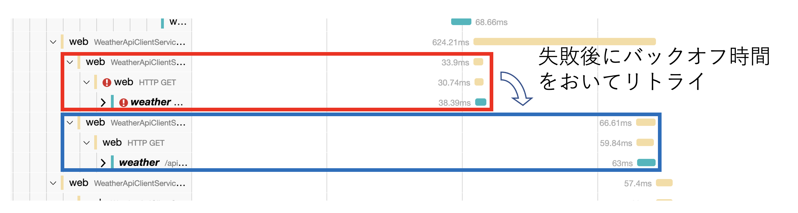

# レジリエンスプログラミングサンプルコード

このリポジトリはマイクロサービスで構成される分散システムにおいて、システムの可用性を高めることができるレジリエンスプログラミングの実例として、Javaのライブラリである Resilience4J を用いて構築したサンプルアプリケーションである。

典型的なWebアプリケーションのサーバーサイド実装をイメージして作成した。

アプリケーションの挙動は、OpenTelemetry でトレーシングして、それを Jaeger で可視化することによってレジリエンスプログラミングがどのように動作しているのかビジュアルで確認することができる。

ビルドおよび実行は Docker 環境を利用してセットアップしているので、docker-compose さえ動けば JDK などのインストールは不要で試すことができる。

## アプリケーションの概要

このアプリケーションはクライアントから `GET /api/v1/meetings` というHTTPのリクエストを受けて、予定されているミーティングの情報を開催地の天気予報とともに返すというものである。
天気予報のデータは weather-service というマイクロサービスで提供され、ミーティング情報ごとにHTTPでマイクロサービスの呼び出しが発生する。

レジリエンスプログラミングの効果を体感するため、weather-service は意図的に不安定に作られていて、20%の確率で 500 Internal Server Error を返すが、サービス全体には影響がない！

## まず動かしてみよう

このリポジトリを clone して docker-compose up するだけで動かすことができる。（はず）

```text
git clone https://github.com/nebosuke/resilience-sample.git
cd resilience-sample
docker-compose up
```

起動後に以下の画面にアクセスすることで動作を確認することができる。

- Webバックエンドサービス : http://localhost:9701/swagger-ui/index.html
- Jaeger : http://localhost:16686/

停止させるには Ctrl-C を押せばよい。

## 動作を確認すべきポイント

Resilience4J を用いてリトライやタイムリミッターを導入している。

web-service の WeatherApiClientService.java には以下のようなコードがある。

```java
Retry retry = resilienceController.getRetryRegistry().retry("fetchForecastOverview");

Supplier<ForecastOverviewResponse> supplier = Decorators.ofSupplier(() -> fetchForecastOverview(area))
        .withRetry(retry)
        .decorate();

return Try.ofSupplier(supplier).recover(throwable -> null).get();
```

このコードが呼び出している `fetchForecastOverview(area)` は内部で weather-service のAPIをHTTPでコールしている。

weather-service はわざと不安定に作られているので、場合によってはここでリトライが行われる様子が Jaeger で確認できる。



## マイクロサービスとエンドポイント

### Webバックエンドサービス (web-service)

クライアントから呼び出される Web で公開されるサーバーをイメージしている。
内部では、weather-service を呼び出している。

#### リクエスト

```http
GET /api/v1/meetings
```

#### レスポンス

```json
[
    {
        "id": "ミーティングのID",
        "title": "ミーティングのタイトル",
        "beginDateTime": "ミーティング開始時刻",
        "endDateTime": "ミーティング終了時刻",
        "weatherForecast": "開催地の天気予報"
    }
]
```

OpenAPI のインタフェースを用意しているので http://localhost:9701/swagger-ui/index.html からAPIをコールすることができる。


### 天気予報サービス (weather-service)

Webバックエンドサービス(web-service)から呼び出される。指定したエリアの天気予報情報をJSONで出力する。

天気予報データのソースとして利用しているのは、気象庁による非公式APIを利用している。予告なく利用不能になる可能性があることに注意。

#### リクエスト

```http
GET /api/v1/weather/{area}
```

- area : 地域のエリアコード (東京は 130000)

#### レスポンス

```json
{
  "statusCode": 1,
  "reportDateTime": "2022-09-28T10:34:00+09:00",
  "text": "　関東甲信地方は、日本海に中心を持つ高気圧に緩やかに覆われています。一方、東海道沖は気圧の谷となっています。\n\n　山梨県は、曇りや晴れとなっています。\n\n　２８日は、高気圧に覆われますが、気圧の谷や湿った空気の影響を受ける見込みです。このため、晴れで夕方から曇りとなり、昼過ぎから夕方にかけて雨の降る所があるでしょう。\n\n　２９日は、高気圧に覆われますが、気圧の谷や湿った空気の影響を受ける見込みです。このため、曇りで、夕方は一時雨となるでしょう。"
}
```

## Jaegerによるトレーシング

http://localhost:16686 で起動している Jaeger によってWebバックエンドサービスの呼び出しを起点として、マイクロサービスがどのように呼び出されたのかをビジュアライズすることができる。


各マイクロサービスでトレーシングデータを生成して Jaeger に送信するために、OpenTelemetry を用いている。

## OpenTelemetry

OpenTelemetry を用いて稼働中のアプリケーションの挙動をマイクロサービスをまたがって分散トレーシングしている。

OpenTelemetry では、ある処理のはじめから終わりまでをスパン(Span)として、処理の引数や所要時間を属性としてスパンに関連づけて出力する。

サンプルコードはJavaで作成されているため、以下のように OpenTelemetry の javaagent を指定してアプリケーションを起動することで自動的にトレーシングされ、トレースされたスパンは OTLP プロトコルで OpenTelemetry Collector に出力されるようになる。

```text
java -javaagent:/opentelemetry-javaagent-1.18.0.jar \
     -Dotel.exporter.otlp.endpoint=http://otel-collector:4317 \
     -jar web-0.0.1-SNAPSHOT.jar
```

サンプルコードでは、HTTPの受信や送信は自動でトレース対象となっている。トレース対象のメソッドをアノテーションで指定することができる `opentelemetry-instrumentation-annotations` ライブラリを導入しているため、実行に時間がかかる一部のメソッドでは `@WithSpan` アノテーションで明示的にスパンを生成するように記述している。

```java
@WithSpan
public void someFunction() {
    // 何か時間のかかる処理
}
```

## OpenTelemetry Collector

各サービスにおいて OpenTelemetry で取得したトレースデータは、OTLP プロトコルで [otel-collector](https://hub.docker.com/r/otel/opentelemetry-collector) に転送している。

OpenTelemetry Collector は、receiver → processor → exporter で構成される。アプリケーションのトレースや、ホストのメトリックスは、OTLP などのプロトコルで OpenTelemetry Collector に送信され、receiver が受信する。

受信したデータは processor に渡され、フィルターや加工され exporter に渡される。

代表的な processor の実装にテイル・サンプリング・プロセッサー（Tail Sampling Processor）がある。テイル・サンプリング・プロセッサーを用いると、平常時は大量のトレースデータをすべて記録せず一部のトレースデータのみを送信しておき、アプリケーションでエラーが発生したときは、時間を遡って関連するすべてのトレースデータをエクスポートすることができる。

各種モニタリングツール用の exporter が用意されているほか、NewRelic などの商用モニタリングツールの側が OTLP プロトコルに対応するようになってきているのであらゆるツールへとエクスポートできる。


サンプルコードでは otel-collector-config.yaml で、OTLP でトレースデータを受信し、Jaeger に出力するように設定している。

